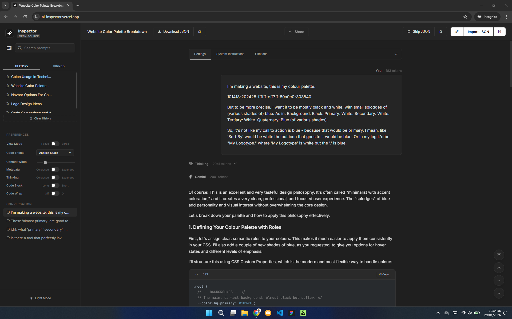

# Inspector - Google AI Studio Viewer

Inspector is a high-performance, open-source visualization tool designed for developers working with Google AI Studio. It transforms raw, difficult-to-read JSON exports into a clean, readable, and interactive conversation timeline.

| Before Inspector | After Inspector |
:-------------------------:|:-------------------------:
 | 

## Why use this?

Google AI Studio is an excellent prototyping environment, but managing long context windows and analyzing history exports presents significant challenges:

*   **Search & Retrieval:** It is notoriously difficult to search through long conversations within the native interface. Finding specific past prompts or responses in a 50k+ token history is often impossible.
*   **Unreadable Exports:** AI Studio exports data to Google Drive as raw, structured JSON. This format is illegible for humans trying to read the conversation flow or analyze the logic.
*   **Hidden Metadata:** Critical information like "Chain of Thought" reasoning blocks, safety ratings, and exact token counts per message are often obscured or completely invisible in the native UI.

Inspector solves this by parsing that raw JSON locally into a rich, searchable interface.

Not enough reason? To find an exhaustive list of benefits that you get from using Inspector, go to: https://ai.timchinye.com/chat/1gTsxi21uaAEwa95Sl4eQ_B9HajiU3RYd.

### How to view an Google AI Studio raw (JSON) export file using Inspector

## Key Features

**Core Connectivity**
*   **Universal Import:** Drag and drop JSON files directly, or paste a Google Drive/AI Studio link.
*   **Smart Paste:** Automatically detects if your clipboard contains raw JSON content or a Google Drive URL and processes it immediately.
*   **Offline Capable:** You can download the source code and run Inspector locally to view your sensitive prompt logs completely offline. (Full PWA support coming soon).
*   **Local Persistence:** Uses IndexedDB to cache your recent history and allows you to "Pin" important logs for instant access later.

**Visualization & Rendering**
*   **Rich Markdown Support:** Renders the conversation with full Markdown support, including tables, lists, and links.
*   **Syntax Highlighting:** Automatically detects coding languages and provides over 15 selectable color themes (e.g., Dracula, Monokai, GitHub Dark) for code blocks.
*   **Drive Attachment Integration:** It also detects Google Drive Documents and Images linked in the JSON. It provides options to open them externally on Google Drive or view them directly within the app using a specialized proxy to prevent CORS.

**Navigation & Analysis**
*   **Dual View Modes:**
    *   *Scroll Mode:* View the entire conversation as a continuous timeline.
    *   *Focus Mode:* Step through the conversation one turn at a time to isolate specific prompt/response pairs, reducing lag.
    *   *Deep Search:* Filters the sidebar list by searching for specific text said during the conversation, making it easy to find specific code snippets or concepts.
*   **Gemini-Specific Metadata:** natively handles "Thinking" blocks (Chain of Thought) with collapsible UI states. It also visualizes safety ratings, token counts for every individual message, system instructions, and other metadata too.

**Developer Workflow Utilities**
*   **Sanitized JSON Export:** IMO: One of the most powerful features for heavy users. If your conversation hits the token limit in AI Studio, you can "Strip" the JSON. This converts the complex structure into a clean array of `role: user` / `role: model` text objects. You can then paste this "clean" history into a *new* AI Studio prompt to continue your session with full context but without the overhead.
*   **Code Block Management:** Toggle text wrapping for long lines, collapse massive code blocks to save scroll space, and copy code with a single click.
*   **Customizable Layout:** Includes a content width slider to adjust the reading area, I'm hoping the ultrawide monitor users would love that one.
*   **Theme Engine:** Fully responsive, Light and Dark modes.

## Advanced Routing & Sharing

Inspector supports a flexible routing system. You can share deep links to specific logs (provided the Google Drive file permissions are set to "Anyone with the link"). The app will automatically parse the ID from almost any reasonable URL structure.

**Query Parameters (Universal Support):**
*   `?view=FILE_ID` (Recommended)
*   `?id=FILE_ID`
*   `?chat=FILE_ID`

**Clean Paths (For SPA Hosts like Vercel/Netlify):**
*   `/view/FILE_ID`
*   `/chat/FILE_ID`
*   `/id/FILE_ID`
*   `/FILE_ID` (Direct path)

**Hash Routing (For Static Hosts like GitHub Pages):**
*   `/#/FILE_ID`
*   `/#FILE_ID`

**Examples:**
- `https://ai-inspector.vercel.app/1jpc4123XaVz3...`
- `https://ai-inspector.vercel.app/chat/1jpc4123XaVz3...`
- `https://ai-inspector.vercel.app/?view=1jpc4123XaVz3...`

*Note: The hash strategy (`/#/FILE_ID`) is also supported for maximum compatibility with static hosts.*

## Self-Hosting

You can easily host your own version of Inspector to use a custom domain (e.g., `ai.yourname.com`). Since the application is stateless and serverless, hosting is free on platforms like Vercel, Netlify, or Render.

1.  **Fork** this repository to your GitHub account.
2.  **Import** your forked repository into Vercel (or your preferred host).
3.  **Deploy**. No build command is required; it is a static HTML/JS site.
4.  **Add Domain:** Configure your custom domain in the Vercel dashboard settings.

You can now share professional links like: `ai.timchinye.com/chat/1jpc4123XaV...`

## Future Roadmap

Development on these features depends on community activity (Issues, Stars, and Pull Requests).

### Browser Extension
*Goal: Enhance AI Studio directly and eliminate the need for manual file exports.*

- **Native Enhancements**: Inject features listed below directly into the Google AI Studio page, such as Regex Search, Smart Snapshots, and Custom Keyboard Shortcuts to improve the native experience.
- **One-Click Inspect**: A toolbar button that extracts the current conversation state and opens it in Inspector instantly, bypassing the "Export to Drive" step entirely.

### Developer Utility
*Goal: Make this an indispensable tool for debugging and sharing.*

- **Smart Snapshots**:
    - **HTML**: Bundle the current DOM + inlined CSS into a single `.html` file. Perfect for attaching to tickets or using as a rich-text "quote" in emails.
    - **Image**: Render specific message blocks as high-quality, watermarked PNGs for easy sharing on Discord, Slack, or Reddit.
- **Diff View**: Add a "Compare" drop zone to highlight added/removed lines between two different model runs.
- **PII Redaction Mode**: Regex-based filter to visually blur emails and API keys (toggleable).
- **Prompt "Fork & Edit"**: Allow in-place text editing and a "Copy Context" button to assemble a new prompt string.

### The "Cinema Mode"
*Goal: Turn static logs into a dynamic, watchable experience.*

- **Typewriter Engine**: Implement a character-by-character (or token-by-token) rendering system that respects HTML tags.
- **Auto-Scroll Physics**: Create a smooth scrolling behavior that keeps the typing cursor centered.
- **Media Controls Overlay**: Build a floating player bar with Play/Pause, Speed Toggle, and a Progress Scrubber.
- **Focus Mode**: Fade out the sidebar and dim the header when playback is active.

### Visual Polish
*Goal: Make the app feel like a native, premium product.*

- **Smooth Scrolling**: Integrate inertial scrolling logic.
- **Magnetic Buttons**: Add micro-interactions where buttons subtly attract towards the cursor.
- **Skeleton Loading**: Replace spinners with shimmering CSS skeletons.
- **Token Heatmap**: Color-coded borders on message bubbles (Green -> Red) based on token intensity.

### Power User Features
*Goal: Efficiency for heavy users.*

- **Regex Search**: Interpret search input as Regular Expressions.
- **Keyboard Shortcuts**: Global hotkeys for navigation (`j`/`k`), modal closing (`Esc`), and file switching.

### Technical Scalability
*Goal: Future-proofing for massive logs.*

- **Web Workers**: Offload parsing operations to background threads to prevent UI freezing on >10MB files.
- **DOM Virtualization**: Implement a virtual scroller to only render nodes currently in the viewport.
- **PWA**: Add Service Worker support for 100% offline usage (Install to Homescreen).
